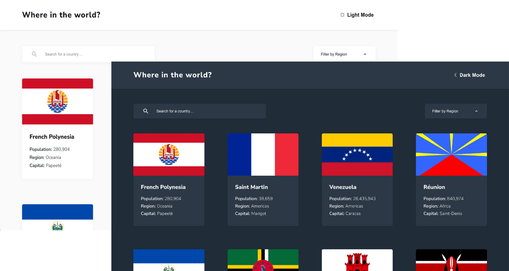
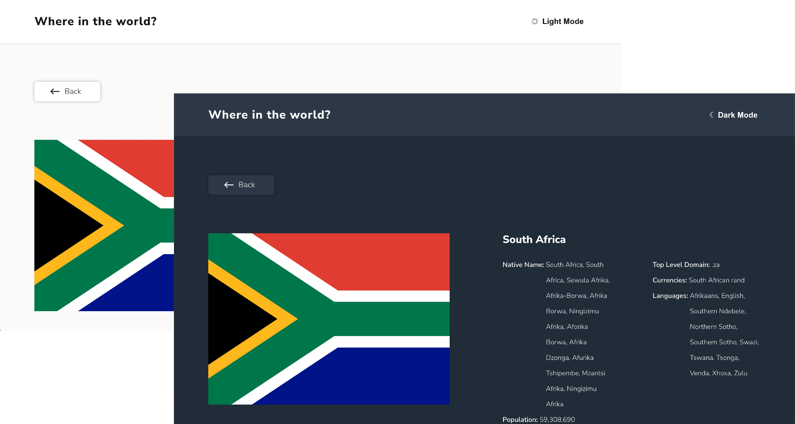
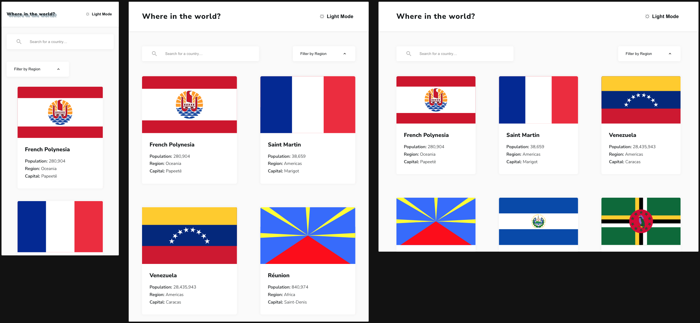
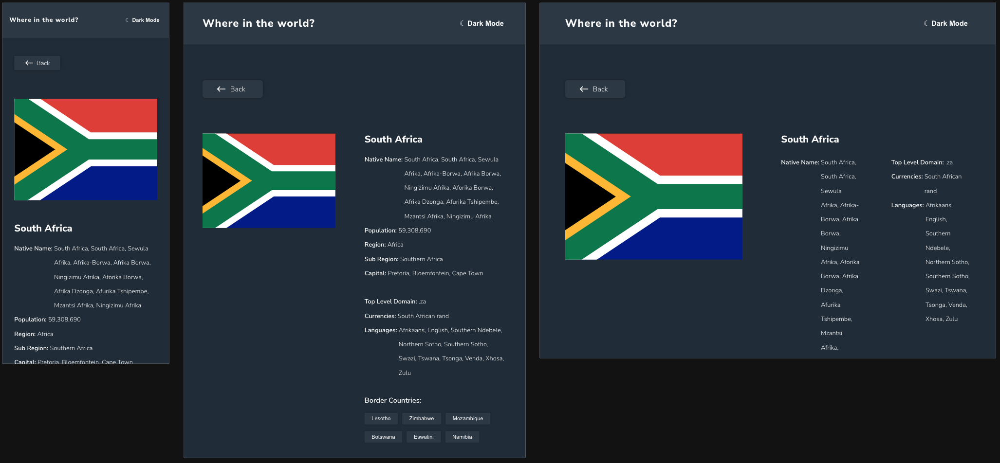
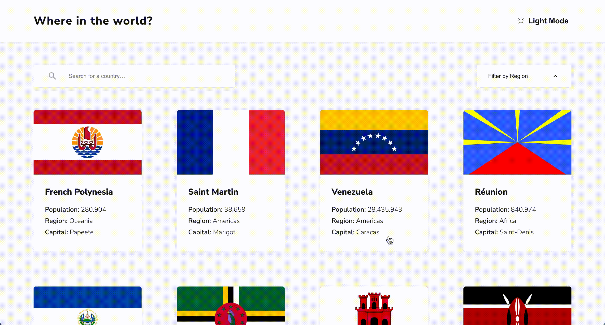
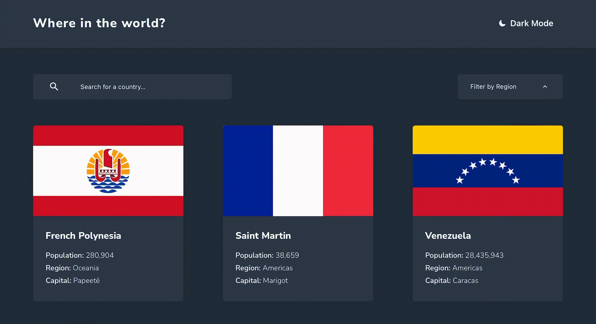

<a name="readme-top"></a>

<div align="center">
    <h1>Where in the world?</h1>
    <p>
        This is a solution to the
        <a href="https://www.frontendmentor.io/challenges/rest-countries-api-with-color-theme-switcher-5cacc469fec04111f7b848ca">REST Countries API with color theme switcher challenge on Frontend Mentor</a>
        .
    </p>
    <p>
        <a href="https://yuna9068.github.io/country-information/">Github Live Site URL</a>
        ·
        <a href="https://www.frontendmentor.io/solutions/rest-countries-api-with-color-theme-switcher-ciKDYl51B3">Frontend Mentor Solution URL</a>
    </p>
</div>




## Table of contents

* [Features](#features)
* [Screenshot](#screenshot)
* [Built with](#built-with)
* [Getting Started](#getting-started)
    * [Prerequisites](#prerequisites)
    * [Installation](#installation)
* [Acknowledgments](#acknowledgments)
* [Author](#author)


## Features

* See all countries from the API on the homepage
* Search for a country using an `input` field
* Filter countries by region
* Click on a country to see more detailed information on a separate page
* Click through to the border countries on the detail page
* Toggle the color scheme between light and dark mode
* Responsive web design
* Scroll to top

<p align="right"><a href="#readme-top">⬆︎ BACK TO TOP</a></p>


## Screenshot

<table>
    <tr>
        <td>
            <p>Home</p>
            
        </td>
        <td>
            <p>Detail</p>
            
        </td>
    </tr>
    <tr>
        <td>
            <p>Home RWD</p>
            
        </td>
        <td>
            <p>Detail RWD</p>
            
        </td>
    </tr>
</table>


<details>
  <summary>GIF</summary>
  <table>
    <tr>
        <td>
            <p>Home</p>
            
        </td>
        <td>
            <p>Detail</p>
            
        </td>
    </tr>
    <tr>
        <td>
            <p>Theme Switcher</p>
            
        </td>
        <td></td>
    </tr>
  </table>
</details>


<p align="right"><a href="#readme-top">⬆︎ BACK TO TOP</a></p>


## Built with

* Mobile-first workflow
* [Vue 3](https://vuejs.org): JavaScript Framework
* [Vue Router 4](https://router.vuejs.org): Official router for Vue
* [Pinia 2](https://pinia.vuejs.org): Store library for Vue
* [Vite 4](https://vitejs.dev): Build tool
* [Axios 1](https://axios-http.com): Promise based HTTP client for the browser and node.js

<p align="right"><a href="#readme-top">⬆︎ BACK TO TOP</a></p>


## Getting Started

To get a local copy up and running follow these simple example steps.

### Prerequisites
* [Node.js](https://nodejs.org) version 16.0 or higher

### Installation
1. Clone the repo
   ```sh
   git clone https://github.com/yuna9068/country-information.git
   ```
2. Install NPM packages
   ```sh
   npm install
   ```
3. Compile and Hot-Reload for Development
    ```sh
    npm run dev
    ```

<p align="right"><a href="#readme-top">⬆︎ BACK TO TOP</a></p>


## Acknowledgments

* [Frontend Mentor](https://www.frontendmentor.io)
* [REST Countries API](https://restcountries.com)
* [Photo of *white and red globe under blue sky during daytime* by Lucas George Wendt on Unsplash](https://unsplash.com/photos/IYm2PCy0f8c)
* Theme Switcher
    * [**實作網頁深色模式及淺色模式的切換** by Mark](https://blog.tarswork.com/post/implement-dark-mode-and-light-mode-for-web-pages)
    * [**Dark Theme Switcher in Vue.js** by yestellar](https://github.com/yestellar/vue_theme_switcher#dark-theme-switcher-in-vuejs)
* Typewriter text animation
    * [**CSS-only typewriter text animation** by Alvaro Montoro](https://codepen.io/alvaromontoro/pen/rNwVpdd)
    * [**小tips: 纯CSS实现打字动画效果** by 张鑫旭](https://www.zhangxinxu.com/wordpress/2019/01/css-typewriter-effect)
* Loading animation
    * [**Star Particles | CSS Only Animation Effects** by Online Tutorials](https://youtu.be/prfvYAzwdxE)
* [**Best-README-Template** by othneildrew](https://github.com/othneildrew/Best-README-Template)

<p align="right"><a href="#readme-top">⬆︎ BACK TO TOP</a></p>


## Author

- GitHub - [Yuna](https://github.com/yuna9068)
- Frontend Mentor - [@yuna9068](https://www.frontendmentor.io/profile/yuna9068)

<p align="right"><a href="#readme-top">⬆︎ BACK TO TOP</a></p>
